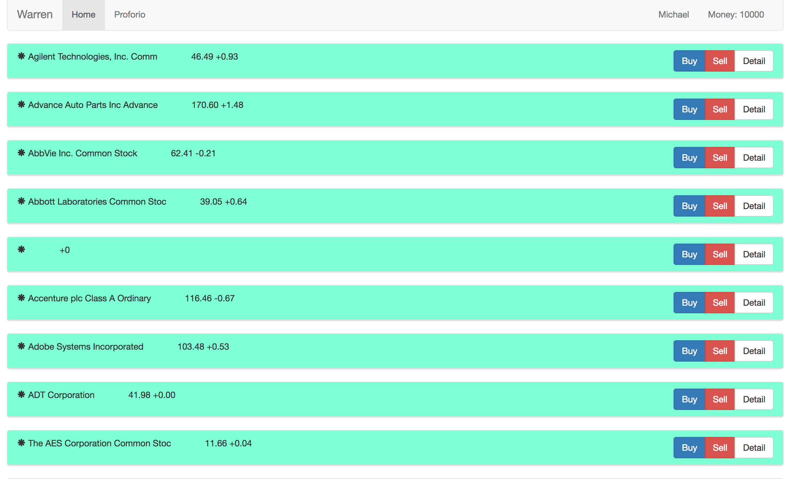
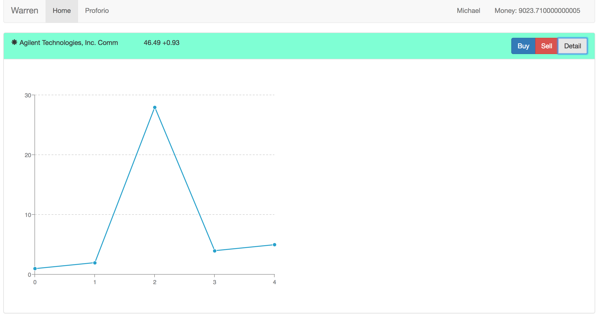

# Trading System

## Features:
This is a simply application which simulate the process of buying stocks in real life. With this app, user has 10000 unit of money as base to either buy or sell the stock, which prices is according to the real data. The real stock data is obtained using YaHoo api.

# Prerequisite
 Make sure have npm installed
 
# Set up:
 * Git clone the repository to the target folder
 * Navigate to the root directory of the project and run "npm install" to install the dependencies. 

# Usage:
Open any browser and go to http://localhost:3000

By clicking buy will add the stock to the proforio and decrease the total money by the amount of the real-time stock price.
Wheras, clicking sell remove the trade from the proforio and increase the total money by the amount the real-time stock price

# Technologies used:
  * Angular 1
  * Zing-Char (For graphing the data)
  * Javascript
  * Bootstrap
  * Yahoo API (For retrieving real-time stock data)
  * Python base framework, flask
